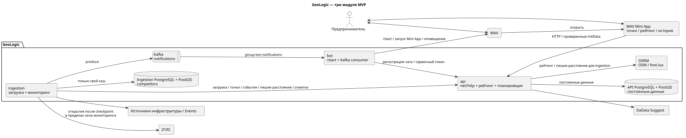

# GeoLogic Monitor

GeoLogic Monitor помогает владельцам кофеен, кафе и небольших ресторанов Санкт-Петербурга оценивать окружение торговых точек и узнавать о важных изменениях рядом. Пользователь работает через MAX Mini App: добавляет точки, смотрит текущий рейтинг и его историю. Бот регистрирует чат и доставляет уведомления.



## Что умеет система

- добавлять, показывать и удалять точки пользователя;
- находить адреса через DaData Suggest;
- рассчитывать рейтинг окружения по инфраструктуре и пешеходным расстояниям;
- хранить историю успешных расчётов и пересчитывать рейтинг по расписанию;
- загружать инфраструктуру и городские события;
- принимать webhook MAX и отправлять сообщения из Kafka.

Сквозной сценарий уведомлений пока не завершён: Kafka consumer в `bot` реализован, producer уведомлений в `ingestion` отсутствует. Остальные возможности выше представлены в текущем коде.

## Пользовательский сценарий

1. Предприниматель запускает бота в MAX и открывает Mini App.
2. Выбирает тип бизнеса и адрес новой точки.
3. API находит объекты рядом, уточняет расстояния через OSRM и сохраняет первый рейтинг.
4. Mini App показывает точку, текущую оценку и график истории.
5. API обновляет рейтинги по расписанию, а ingestion собирает изменения окружения для уведомлений.

Подробное описание: [продукт и пользовательский сценарий](docs/product.md).

## Сервисы

| Компонент | Ответственность | Документация |
| --- | --- | --- |
| `api` | Постоянные данные, HTTP-контракт, геокодинг, рейтинг и планировщик | [README API](api/README.md) |
| `ingestion` | Загрузка инфраструктуры и событий, мониторинг изменений | Документация будет добавлена отдельно |
| `bot` | Webhook MAX, `/start`, Kafka consumer и отправка уведомлений | Документация будет добавлена отдельно |
| `miniapp` | Пользовательский интерфейс точек, рейтинга и истории | Документация будет добавлена отдельно |
| `osrm` | Локальная пешеходная маршрутизация | [README OSRM](osrm/README.md) |

Сервисы независимы: `api`, `ingestion` и `bot` являются отдельными Go-модулями, а `miniapp` — приложением React/TypeScript. Постоянными данными владеет API; остальные сервисы обращаются к нему по HTTP.

## Технологии

Go 1.27, `net/http`, PostgreSQL 18 и PostGIS 3.6, React 19, TypeScript, Vite, Kafka, franz-go, OSRM, Docker Compose и Taskfile.

## Быстрый запуск

Подготовьте env-файлы по шаблонам и запустите Compose:

```bash
cp .env.template .env
cp api/.env.template api/.env
cp ingestion/.env.template ingestion/.env
cp bot/.env.template bot/.env
docker compose up --build -d
```

Короткая команда при установленном [Task](https://taskfile.dev/):

```bash
task all:up
```

Подробности, требования и запуск отдельных компонентов находятся в [инструкции по локальной разработке](docs/local-development.md).

## Документация

- [Архитектура системы](docs/architecture.md)
- [Продукт и пользовательский сценарий](docs/product.md)
- [Обзор владения данными](docs/data-model.md)
- [Рейтинг окружения](docs/impact-engine.md)
- [Документация API](api/README.md)
- [HTTP OpenAPI](api/docs/openapi.yaml)
- [Kafka AsyncAPI](docs/asyncapi/notifications.yaml)
- [Локальная разработка](docs/local-development.md)
- [Исходники и изображения диаграмм](docs/diagrams/README.md)
- [Правила работы с репозиторием](CONTRIBUTING.md)
